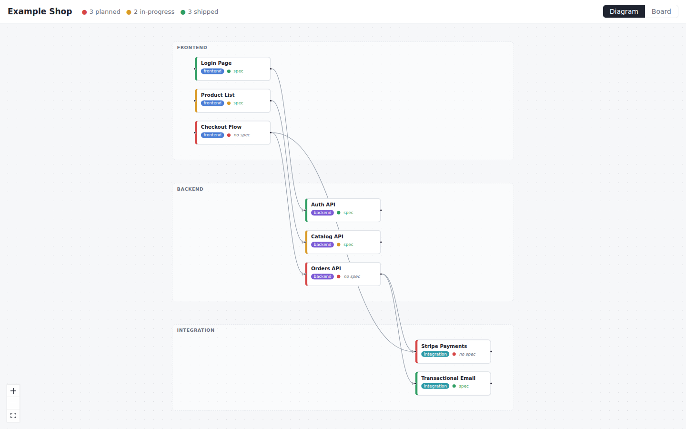

# diagram-copilot

A visual dashboard for **spec-driven development**. Each project keeps a
`project.yaml` describing its frontend components, backend components, and
APIs/integrations, each with a `planned` / `in-progress` / `shipped` status and
an optional markdown spec. This tool renders that file as an architecture
diagram and a kanban board — the master view humans glance at and agents use to
decide what still needs planning or building.

The yaml file is the source of truth. Agents (and humans) edit it directly;
the viewer is read-only and live-reloads on every change. See
[AGENTS.md](AGENTS.md) for the schema and the editing rules agents follow.



## Usage

```sh
npm install
npm run build          # build the viewer (one-time, or after changing web/)
node server.js path/to/project.yaml [--port 4400] [--no-open]
```

Or try the bundled example:

```sh
npm start              # serves example/project.yaml on http://localhost:4400
```

## Views

- **Diagram** — items laid out in three lanes (frontend / backend /
  integration); dependency edges from `depends`; border color = status.
- **Board** — kanban columns for planned / in-progress / shipped.
- **Priority** — non-shipped items in dependency order; ready items first, blocked items show their blockers.
- **Detail panel** — click any item: notes, dependency links both directions,
  and the spec markdown rendered inline. "No spec yet" is the signal that an
  item still needs planning.

## project.yaml

```yaml
project: My App
items:
  - id: login-page          # unique, kebab-case
    name: Login Page
    type: frontend          # frontend | backend | integration
    status: in-progress     # planned | in-progress | shipped
    spec: docs/specs/login.md   # optional, relative to the yaml file
    depends: [auth-api]     # ids this item calls/uses -> diagram edges
    notes: optional freeform
```

Validation problems (duplicate ids, unknown type/status, dangling `depends`)
are shown as a banner in the UI instead of crashing the server.

## Development

```sh
node server.js example/project.yaml --no-open   # API on :4400
npm --prefix web run dev                        # Vite dev server, proxies /api
```
